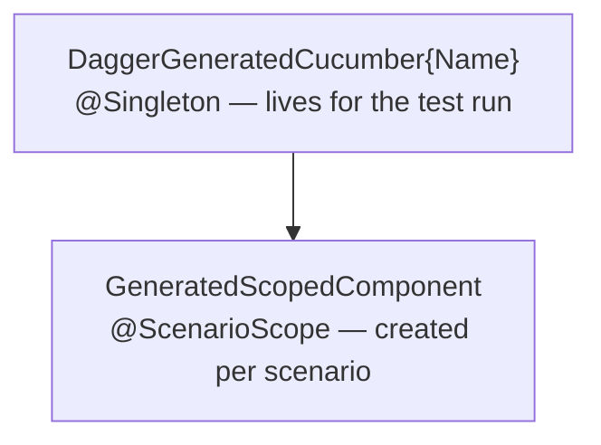
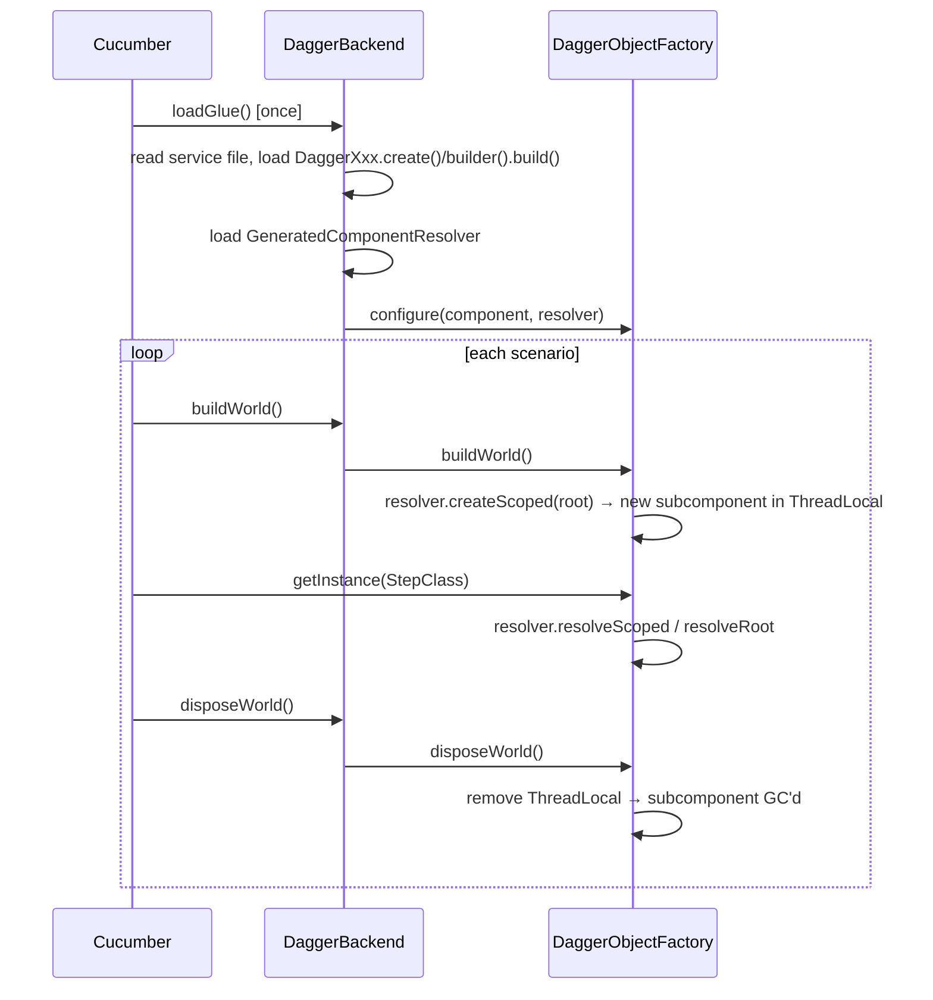

# Architecture

## Overview

Three layers work together to wire Dagger into a Cucumber test run:

| Layer | Component | Responsibility |
|---|---|---|
| Compile-time | `cucumber-dagger-processor` | Reads `@CucumberDaggerConfiguration`, emits generated sources |
| Generated code | Dagger compiler | Processes generated sources, produces `Dagger*` impl classes |
| Runtime | `cucumber-dagger` | Implements Cucumber Backend/ObjectFactory SPIs, drives the lifecycle |

## Module structure

| Artefact | Purpose |
|---|---|
| `dev.joss:cucumber-dagger` | Runtime: annotations, `DaggerBackend`, `DaggerObjectFactory`, `ComponentResolver` |
| `dev.joss:cucumber-dagger-processor` | Annotation processor |
| `dev.joss:cucumber-dagger-bom` | Version BOM aligning the two modules above |

## Generated files

The processor emits six artefacts for each `@CucumberDaggerConfiguration` interface:

| File | What it is |
|---|---|
| `GeneratedScopedModule` | `@Module` that includes all user scoped modules |
| `GeneratedScopedComponent` | `@ScenarioScope @Subcomponent` with provision methods for step defs and scoped types |
| `CucumberDaggerModule` | `@Module` declaring the subcomponent and providing the `ScenarioScopedComponent.Builder` binding |
| `GeneratedCucumber{Name}` | `@Component` wrapper extending the user's interface and `CucumberDaggerComponent`; includes `@Component.Builder` when the user declared one |
| `GeneratedComponentResolver` | Implements `ComponentResolver` — type-dispatching without reflection |
| `META-INF/services/…CucumberDaggerComponent` | Service-loader entry pointing to `DaggerGeneratedCucumber{Name}` |

## Component hierarchy

The root component holds all `@Singleton` bindings. The subcomponent inherits them and owns the `@ScenarioScope` bindings. Step definitions are provision methods on the subcomponent and receive both.

## Runtime lifecycle

The `ThreadLocal` in `DaggerObjectFactory` makes the framework safe for parallel scenario execution.

## Step definition discovery

A class is discovered as a step definition when:
- It has a constructor annotated with `@Inject`
- Its package equals or starts with the root component's package

The processor generates a provision method on `GeneratedScopedComponent` and a dispatch branch in `GeneratedComponentResolver.resolveScoped` for each discovered class.
