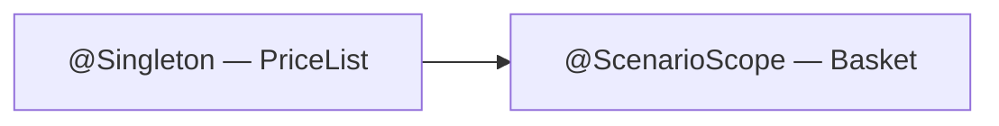

# Scenario scope

`@ScenarioScope` bindings are created once per scenario and discarded when it ends. The next scenario gets fresh instances.

| Scope | Lifetime | Annotation |
|---|---|---|
| `@Singleton` | Entire test run | On `@Provides` method or component |
| `@ScenarioScope` | Single scenario | On `@Provides` method only |

## Declaring a scoped binding

Add `@Provides @ScenarioScope` to a method in a `@Module` and list that module on your root `@Component`. The processor moves it to the generated subcomponent automatically.

```java
@Module
public final class ScenarioModule {

    @Provides
    @ScenarioScope
    static Basket provideBasket(PriceList priceList) {
        return new Basket(priceList);
    }
}
```

## Sharing state between step definitions

Two step definition classes injecting the same `@ScenarioScope` type receive the **same instance** within one scenario. Mutations in one class are visible in another.

```java
// Both receive the same Basket instance for the current scenario
public final class AddItemSteps {
    @Inject AddItemSteps(Basket basket) { ... }
}

public final class TotalSteps {
    @Inject TotalSteps(Basket basket) { ... }
}
```

## Cross-scope dependencies

A `@ScenarioScope` binding may depend on a `@Singleton` binding. The reverse is not valid — Dagger reports a scope violation at compile time.



## Constraints

| Constraint | Detail |
|---|---|
| No qualifiers | `@ScenarioScope` + `@Named` on the same method → compile error |
| Method-level only | Annotating a class with `@ScenarioScope` has no effect; use `@Provides` methods |
